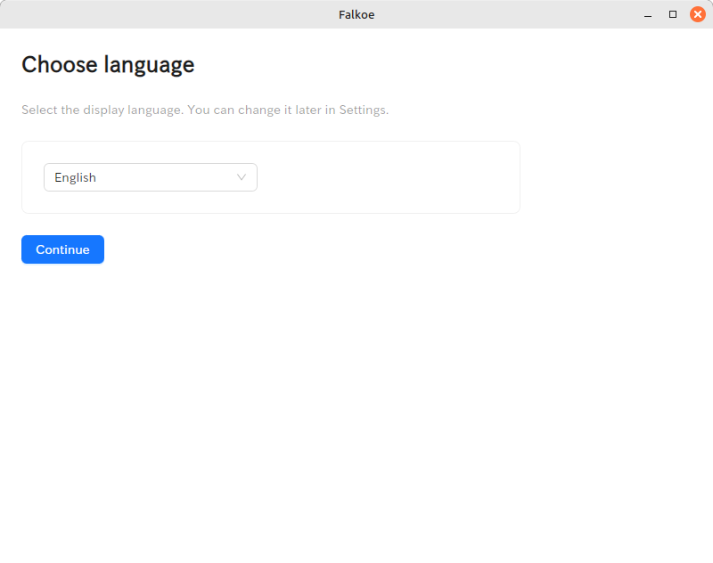
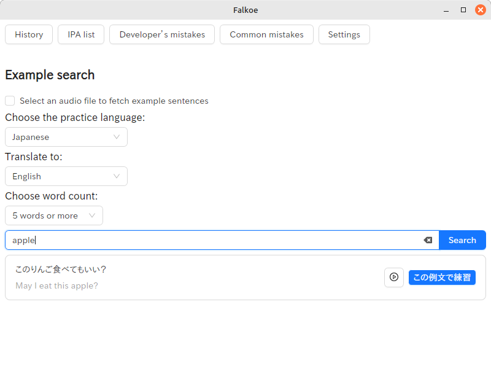
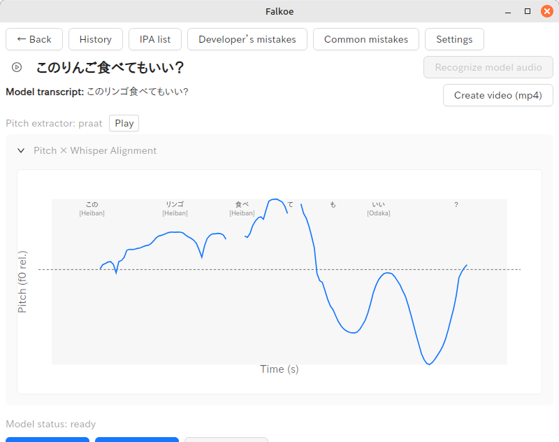
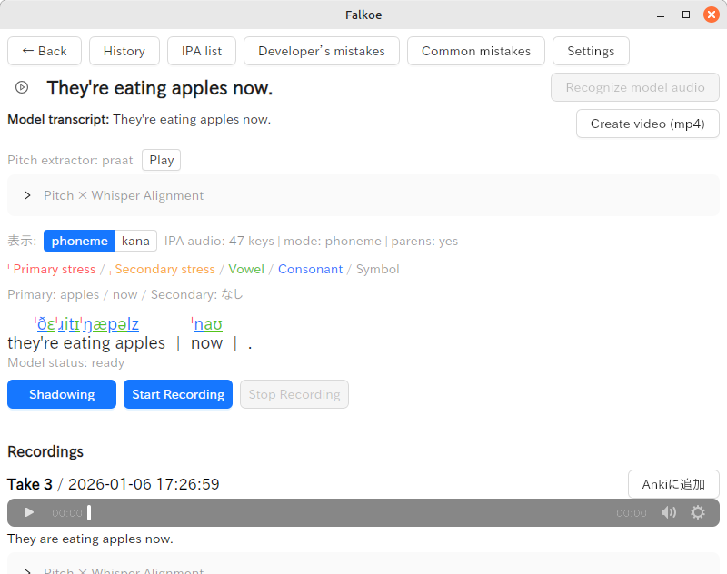

# Falkoe (ふぁるこえ)

**Voice-powered language learning app**  
あなたの声で学ぶ、言語学習アプリ

---

## 📸 Screenshots









---

## 🌟 Concept / コンセプト

### 🌍 Cross-platform

This app runs on multiple platforms: **Windows (msi), Linux (deb / rpm), and macOS**.

---

### 皆さんは、暗記が得意ですか？

私は、「覚える」という作業がずっと苦手でした。  
ですがあるとき、自分の声で作った英単語帳を使ってみたのです。

すると――驚くほど記憶に残りました。  
「自分の声」には、思っていた以上の力があると実感しました。

---

語学学習において、**自分の声を確認すること**は避けて通れない道だと思っています。  
だから私は、**声を活用した、シンプルな言語学習アプリ**を作りました。

---

このアプリでは、あなた自身の声を使って：

- **Anki 用のデッキを自動生成**
- **発音やフレーズ練習を記録・振り返り**

ができます。

---

**見本の声、あなたの声、そして私ふぁるの声。**  
言語学習のための「声」が、ここに集まります。

---

### 🗣️ 言ってほしいセリフ、録音してみたいフレーズがあれば、ぜひ投稿してください。

**私、ふぁるも手伝います。**

---

これが「**ふぁる化**」。  
あなたも一緒に、「**ふぁるこえ**」になりましょう。

---

### Are you good at memorization?

I have always struggled with memorizing things.  
One day, I tried using a vocabulary deck made with **my own voice**.

The result surprised me — the words stayed in my memory far better than expected.  
That was when I realized how powerful **your own voice** can be.

---

In language learning, I believe that **listening to and checking your own voice** is unavoidable.  
That belief led me to create a **simple language learning app centered around voice**.

---

With this app, you can use _your own voice_ to:

- **Automatically generate Anki decks**
- **Record and review pronunciation and phrase practice**

---

**Sample voices, your voice, and my voice — Falkoe's voice.**  
All the voices needed for language learning come together here.

---

### 🗣️ If there's a sentence you want spoken or a phrase you want to record, feel free to share it.

**I, Falkoe, will help you.**

---

This is **"Fal-fication."**  
Join me, and let's become **"Falkoe voices."**

---

## 🔄 声の共有 / Voice Sharing

このアプリでは、録音した音声を他のユーザーと共有できます（予定）。

- **自分の発音を投稿**
- **他のユーザーの音声を参考に**
- **コミュニティで学び合う**
- **P2P方式で直接共有**

あなたの声が、誰かの学びを助けるかもしれません。

---

Share your recorded voices with other users (planned):

- **Post your pronunciation**
- **Learn from others' voices**
- **Build a learning community together**
- **Direct P2P sharing**

Your voice might help someone else's learning journey.

---

## ✨ Features / 機能

- ✅ **マイク録音** — 自分の声を簡単に録音
- ✅ **音声認識 (Whisper)** — ローカルで音声をテキスト化
- ✅ **Anki デッキ生成** — 録音からAnki用のデッキを自動作成
- ✅ **クロスプラットフォーム** — Windows / Linux / macOS 対応
- ✅ **練習動画の記録** — 発音練習を動画で残す
- 🚧 **音声共有 (P2P)** — ユーザー間で音声を共有（開発中）

---

- ✅ **Mic recording** — Record your voice easily
- ✅ **Speech recognition (Whisper)** — Local, offline speech-to-text
- ✅ **Anki deck generation** — Auto-generate Anki decks from recordings
- ✅ **Cross-platform** — Windows / Linux / macOS support
- ✅ **Practice video recording** — Save pronunciation practice as video
- 🚧 **Voice sharing (P2P)** — Share voices between users (in development)

---

## 💻 動作要件 / System Requirements (CPU)

### Whisper（音声認識）について

Falkoe の音声認識は `whisper.cpp/ggml` ベースです。Windows の x86_64 配布版では **AVX 命令対応CPUが必須**です。

- ✅ **最低要件（Windows x86_64）**: **AVX 対応CPU**
- ⚡ **推奨（高速）**: **AVX2 対応CPU**（対応していれば自動でより高速な実装が選ばれます）

AVX が無い CPU だと、起動直後に Whisper が `Illegal instruction` 相当で落ちることがあります（例: `0xC000001D`）。

目安（Intel/AMD）:

- Intel: **第2世代 Core (Sandy Bridge) 以降**
- AMD: **Bulldozer 世代 (FX) 以降**

確認方法（例）:

- Windows: Sysinternals の `coreinfo.exe -f` を実行し、`AVX` が `*` になっているか確認
- Linux: `lscpu | grep -i avx`

---

### About Whisper (speech recognition)

Falkoe uses a `whisper.cpp/ggml` backend. On **Windows x86_64 distribution builds**, a CPU with **AVX support is required**.

- ✅ **Minimum (Windows x86_64)**: CPU with **AVX**
- ⚡ **Recommended (faster)**: **AVX2** (when available, a faster backend is selected automatically at runtime)

If your CPU does not support AVX, Whisper may crash immediately with an “Illegal instruction” type error (e.g. `0xC000001D`).

Rough guidance:

- Intel: **2nd-gen Core (Sandy Bridge) or later**
- AMD: **Bulldozer-era (FX) or later**

How to check (examples):

- Windows: run Sysinternals `coreinfo.exe -f` and look for `AVX` marked with `*`
- Linux: `lscpu | grep -i avx`

## 📦 Bundled Tools (ffmpeg) / 同梱ツール(ffmpeg)

Falkoe は音声変換(mp3→wavなど)のために `ffmpeg` を使います。

- **配布版(推奨)**: アプリに `ffmpeg` を同梱できます。
- **開発/同梱なし**: システムの `ffmpeg` が PATH に入っている必要があります。

### 同梱パス

Tauri の `resource_dir` から次のパスを探します（見つからなければ PATH の `ffmpeg` にフォールバックします）。

- Windows: `resources/bin/ffmpeg.exe`
- macOS / Linux: `resources/bin/ffmpeg`

設定は [src-tauri/tauri.conf.json](src-tauri/tauri.conf.json) の `bundle.resources` に `resources/bin` を含めています。

> 注意: Falkoe はGPLv3+で配布しています。配布版では `ffmpeg` も **GPLビルドを同梱**する想定です。バイナリを再配布する場合は、GPLの条件（対応するソースの提供等）を満たしてください。

#### 🪟 Windows注意: 「shim版 ffmpeg.exe」を同梱しない

Windowsで `choco` / `scoop` 等で入れた `ffmpeg.exe` は、実体の場所を探すための **shim(呼び出し用exe)** の場合があります。

以下のようなエラーが出る場合、shimを同梱してしまっています：

```
Cannot find file at '..\lib\ffmpeg\tools\ffmpeg\bin\ffmpeg.exe' ...
```

この場合は、**本物のffmpegビルド**（単体で動く `ffmpeg.exe`）を同梱してください。

- 推奨: 公式/配布サイトのzipを展開して `bin/ffmpeg.exe` をコピー
- もし `bin/*.dll` が付属しているビルドなら、`ffmpeg.exe` と同じ `resources/bin/` に **DLLも一緒に置く**（DLL不足で起動失敗するため）

最終確認: `resources/bin/ffmpeg.exe -version` がそのフォルダ内で単体実行できること

---

Falkoe uses `ffmpeg` for audio conversion (e.g., mp3 → wav).

- **Distribution build (recommended)**: `ffmpeg` can be bundled with the app.
- **Development / non-bundled**: System `ffmpeg` must be available in PATH.

### Bundled Path

The app searches for `ffmpeg` in the following paths from Tauri's `resource_dir` (falls back to PATH if not found):

- Windows: `resources/bin/ffmpeg.exe`
- macOS / Linux: `resources/bin/ffmpeg`

Configuration is set in [src-tauri/tauri.conf.json](src-tauri/tauri.conf.json) with `resources/bin` included in `bundle.resources`.

> Note: Falkoe is distributed under GPLv3+ and release builds are intended to bundle a **GPL build** of `ffmpeg`. If you redistribute binaries, ensure you meet GPL obligations (including providing corresponding source).

---

## 📦 Bundled Tools (Praat) / 同梱ツール(Praat)

Falkoe のピッチ抽出は、可能なら **Praat** を使います（より安定したF0抽出のため）。

- **配布ビルド（推奨）**: Praat をアプリに同梱できます（`resources/bin/praat(.exe)`）。
- **開発/非同梱**: システムの `praat` が PATH に入っていれば使われます。
- **Praatが使えない場合**: 内蔵の簡易YIN実装にフォールバックします（動作は継続します）。

> 注意: Praat の再配布・同梱はライセンス条件の確認が必要です。

---

## 📦 Optional Tool (WORLD helper) / 任意ツール(WORLD)

Praatを同梱しない場合でも、より安定したF0抽出をしたいときは **WORLD系の外部ヘルパー**を同梱できます。

- **必須ではありません**: 無い場合は内蔵YINへフォールバックします。
- **同梱場所**:
  - Windows: `resources/bin/world_pitch.exe`
  - macOS / Linux: `resources/bin/world_pitch`

### 期待するヘルパー仕様（現状の実装）

アプリは次の形式でヘルパーを呼び出します:

`world_pitch <wav_path> <out_tsv_path> <time_step> <pitch_floor> <pitch_ceiling>`

ヘルパーは `out_tsv_path` にTSV（タブ区切り）で出力します:

`time<TAB>f0_hz` （ヘッダなしでOK、f0が無いフレームは0/空/NaNなどでも可）

> 注意: WORLD自体やヘルパー実装のライセンスは別途確認してください（配布物に同梱する場合は再配布になります）。

### 同梱パス

Tauri の `resource_dir` から次の順で探します。

1. `resources/bin/praatcon(.exe)`
2. `resources/bin/praat(.exe)`
3. PATH の `praat`

### 同梱スクリプト

同梱スクリプトは次に置かれます:

- `resources/praat/extract_pitch_to_tsv.praat`

設定は [src-tauri/tauri.conf.json](src-tauri/tauri.conf.json) の `bundle.resources` に `resources/praat` を含めています。

> 注意: Praat の再配布・同梱はライセンス条件の確認が必要です。

---

Falkoe uses **Praat** for pitch extraction when available (for more stable F0 extraction).

- **Distribution build (recommended)**: `praat` / `praatcon` can be bundled with the app.
- **Non-bundled**: System `praat` in PATH will be used if available.
- **Fallback**: If Praat is unavailable, the app falls back to a built-in simple YIN implementation (functionality continues).

### Bundled Path

The app searches in the following order from Tauri's `resource_dir`:

1. `resources/bin/praatcon(.exe)`
2. `resources/bin/praat(.exe)`
3. `praat` in PATH

### Bundled Script

The bundled script is located at:

- `resources/praat/extract_pitch_to_tsv.praat`

Configuration is set in [src-tauri/tauri.conf.json](src-tauri/tauri.conf.json) with `resources/praat` included in `bundle.resources`.

> Note: Redistribution and bundling of Praat requires compliance with its license terms.

---

## 📦 Optional Tool (MeCab) / 任意ツール(MeCab)

Falkoe は日本語のアクセント表示（`*.accent.json`）を自然な単語単位にするために、可能なら **MeCab** を使います。

- **必須ではありません**: MeCab が無い環境でも動作します（従来の単語分割へフォールバック）。
- **あると改善します**: Whisper の `words` が1文字単位になってしまうケース（例: `明` / `日`）を、`明日` のような自然な境界に再構成します。
- **辞書が必要です**: MeCab 本体に加えて辞書（例: `ipadic`）が必要です。

### 同梱（配布ビルド）

配布版では、Tauri の `resource_dir` 配下に MeCab と辞書を置くことで **システムへの別途インストール無し**で使えます。

- Windows: `resources/bin/mecab.exe`
- macOS / Linux: `resources/bin/mecab`
- 辞書: `resources/mecab/ipadic/`（`dicrc` があるディレクトリ）

設定は [src-tauri/tauri.conf.json](src-tauri/tauri.conf.json) の `bundle.resources` に `resources/mecab` を含めています。

### 環境変数での上書き（任意）

- `FALKOE_MECAB_PATH`: MeCab 実行ファイルのパスを固定したい場合
- `FALKOE_MECAB_DICDIR`: 辞書ディレクトリ（`dicrc` のある場所）を指定したい場合

### 開発環境でのインストール例

- Linux (Debian/Ubuntu):
  - `sudo apt update`
  - `sudo apt install -y mecab mecab-ipadic-utf8`
  - ※環境によっては `mecab-ipadic` の場合もあります
- macOS (Homebrew):
  - `brew install mecab mecab-ipadic`
- Windows (Chocolatey):
  - `choco install -y mecab mecab-ipadic`

### デバッグ（MeCab 経路が使われているか確認）

`FALKOE_DEBUG_MECAB=1` を付けて起動すると、バックエンドログに MeCab の利用状況が出ます（例: `[mecab] alignment ok`, `[accent] mecab used: ...`）。

- Linux/macOS (bash/zsh): `FALKOE_DEBUG_MECAB=1 pnpm tauri dev`
- Linux/macOS (POSIX): `env FALKOE_DEBUG_MECAB=1 pnpm tauri dev`
- Windows (PowerShell): `$env:FALKOE_DEBUG_MECAB=1; pnpm tauri dev`
- Windows (cmd.exe): `set FALKOE_DEBUG_MECAB=1 && pnpm tauri dev`

---

Falkoe optionally uses **MeCab** to build natural word boundaries for Japanese accent overlay output (`*.accent.json`).

- **Not required**: The app still works without MeCab (falls back to the default tokenization).
- **Improves Japanese tokenization**: Helps avoid cases where Whisper `words` become character-by-character (e.g. `明` / `日`) and reconstructs them into natural units (e.g. `明日`).
- **Dictionary required**: You need MeCab plus a dictionary (e.g. `ipadic`).

### Bundling (distribution builds)

For distribution builds, you can place MeCab and its dictionary under Tauri's `resource_dir` so users don't need a separate system install.

- Windows: `resources/bin/mecab.exe`
- macOS / Linux: `resources/bin/mecab`
- Dictionary: `resources/mecab/ipadic/` (directory containing `dicrc`)

The app bundle is configured in [src-tauri/tauri.conf.json](src-tauri/tauri.conf.json) (`bundle.resources`) to include `resources/mecab`.

### Environment overrides (optional)

- `FALKOE_MECAB_PATH`: force a specific MeCab executable path
- `FALKOE_MECAB_DICDIR`: force a specific dictionary directory (containing `dicrc`)

### Install examples (development)

- Linux (Debian/Ubuntu):
  - `sudo apt update`
  - `sudo apt install -y mecab mecab-ipadic-utf8`
  - Note: some environments use `mecab-ipadic` instead
- macOS (Homebrew): `brew install mecab mecab-ipadic`
- Windows (Chocolatey): `choco install -y mecab mecab-ipadic`

### Debug (verify MeCab path is used)

Start with `FALKOE_DEBUG_MECAB=1` to see backend logs such as `[mecab] alignment ok` and `[accent] mecab used: ...`.

- Linux/macOS (bash/zsh): `FALKOE_DEBUG_MECAB=1 pnpm tauri dev`
- Linux/macOS (POSIX): `env FALKOE_DEBUG_MECAB=1 pnpm tauri dev`
- Windows (PowerShell): `$env:FALKOE_DEBUG_MECAB=1; pnpm tauri dev`
- Windows (cmd.exe): `set FALKOE_DEBUG_MECAB=1 && pnpm tauri dev`

---

## 🧠 Whisper Model / 音声認識モデル(Whisper)

Falkoe の音声認識は Whisper（`whisper.cpp` 互換の `ggml-*.bin`）を使います。

- 基本はアプリ内の「Settings」からモデルを選ぶのがおすすめです（設定は保存されます）。
- **環境変数がある場合は環境変数が優先**されます（主に開発/検証用）。

### 環境変数（任意）

### GPU acceleration (optional) / GPU高速化（任意）

Whisper は **デフォルトではCPUで動きます**（配布での互換性を優先）。

GPUを使いたい場合は、ビルド時にバックエンドを有効化した **別ビルド**を作ってください：

- Linux/Windows: `--features whisper-vulkan`
- macOS: `--features whisper-metal`

> 注意: GPUを“積んでいる”だけでは使われません。Vulkan/Metalのランタイム（ドライバ等）が正しく入っていて、
> かつバックエンド有効でビルドされている必要があります。

#### LinuxでVulkanビルドする場合（開発用）

`whisper-vulkan` はビルド時に Vulkan と `glslc`（shader compiler）が必要です。

- Debian/Ubuntu 例:
  - `sudo apt update`
  - `sudo apt install -y cmake libvulkan-dev glslc`
  - （実行時に必要なことが多い）`sudo apt install -y libvulkan1 vulkan-tools`

ビルド例:

```bash
cd src-tauri
cargo check --features whisper-vulkan
```

Vulkanが有効か確認したい場合は `vulkaninfo`（`vulkan-tools`）を実行して、GPUが列挙されるか確認してください。

#### モデルの選択/上書き

- `FALKOE_MODEL_VARIANT`: ダウンロードするモデルを指定します。
  - 対応例: `tiny`, `tiny-q8_0`, `tiny-q5_1`, `base`, `base-q8_0`, `base-q5_1`, `small`, `small-q8_0`, `small-q5_1`, `medium`, `medium-q8_0`, `medium-q5_0`, `large-v3`, `large-v3-q5_0`, `large-v3-turbo`, `large-v3-turbo-q5_0`, `large-v3-turbo-q8_0`
  - 例 (Linux/macOS): `FALKOE_MODEL_VARIANT=tiny-q8_0 pnpm tauri dev`
- `FALKOE_MODEL_URL`: モデルのダウンロードURLを直接指定します（上級者向け）。
- `FALKOE_MODEL_FILENAME`: 保存するファイル名を指定します（上級者向け）。

> 注意: `FALKOE_MODEL_URL` / `FALKOE_MODEL_FILENAME` で独自モデルを指定する場合、ファイル名に `tiny` / `base` / `small` / `medium` / `large-v3` などが含まれないと、JA向けの DTW が安全のため自動的に無効化されることがあります。

#### Whisper 実行パラメータ（速度/安定性調整）

- `FALKOE_WHISPER_THREADS`: Whisper のスレッド数を固定します（未指定ならCPUコア数から自動）。
  - 例: `FALKOE_WHISPER_THREADS=8`
- `FALKOE_WHISPER_DTW`: DTW のON/OFFを上書きします。
  - `0` = 無効、`1` = 強制有効（未指定なら原則 `ja` のときだけ有効）
- `FALKOE_WHISPER_BEAM_SIZE`: Beam search を有効化します（`>1` の場合）。
- `FALKOE_WHISPER_BEST_OF`: Greedy の `best_of` を指定します（`FALKOE_WHISPER_BEAM_SIZE=1` のとき有効）。

### Windowsでの指定例

- PowerShell:
  - `$env:FALKOE_MODEL_VARIANT="tiny-q8_0"; pnpm tauri dev`
  - `$env:FALKOE_WHISPER_THREADS=8; pnpm tauri dev`
- cmd.exe:
  - `set FALKOE_MODEL_VARIANT=tiny-q8_0 && pnpm tauri dev`
  - `set FALKOE_WHISPER_THREADS=8 && pnpm tauri dev`

---

Falkoe uses Whisper models (`whisper.cpp`-compatible `ggml-*.bin`).

- Recommended: select the model in the app Settings (persisted).
- If environment variables are set, **they take precedence** (mainly for development/testing).

### Environment variables (optional)

#### Model selection / overrides

- `FALKOE_MODEL_VARIANT`: choose which model to download.
  - Examples: `tiny`, `tiny-q8_0`, `tiny-q5_1`, `base`, `base-q8_0`, `base-q5_1`, `small`, `small-q8_0`, `small-q5_1`, `medium`, `medium-q8_0`, `medium-q5_0`, `large-v3`, `large-v3-q5_0`, `large-v3-turbo`, `large-v3-turbo-q5_0`, `large-v3-turbo-q8_0`
  - Example (Linux/macOS): `FALKOE_MODEL_VARIANT=tiny-q8_0 pnpm tauri dev`
- `FALKOE_MODEL_URL`: override the model download URL (advanced).
- `FALKOE_MODEL_FILENAME`: override the saved filename (advanced).

> Note: if you override the URL/filename with a custom model and the filename does not contain `tiny` / `base` / `small` / `medium` / `large-v3` etc, DTW (used mainly for Japanese) may be auto-disabled for safety.

#### Whisper runtime tuning

- `FALKOE_WHISPER_THREADS`: set Whisper thread count (auto-detected if unset).
- `FALKOE_WHISPER_DTW`: override DTW.
  - `0` = disable, `1` = force enable (default: enabled mainly for `ja` only)
- `FALKOE_WHISPER_BEAM_SIZE`: enable Beam search when `>1`.
- `FALKOE_WHISPER_BEST_OF`: Greedy `best_of` (only when `FALKOE_WHISPER_BEAM_SIZE=1`).

## 🚀 Getting Started / はじめ方

### 1. Download / ダウンロード

Pre-built binaries are available on the GitHub Releases page:

**https://github.com/falog/falkoe/releases**

### 2. Install / インストール

各プラットフォームのインストール方法は下記を参照してください。  
See platform-specific installation instructions below.

### 3. Launch / 起動

アプリを起動して、マイク録音から始めましょう！  
Launch the app and start recording with your microphone!

---

## 📦 Installation / インストール

### 🪟 Windows

#### Install

Download the `.msi` file and run it.

`.msi` ファイルをダウンロードして実行してください。

#### ⚠️ Windows SmartScreen について / Notice

本アプリは現在、コード署名されていません。

初回起動時に Windows SmartScreen の警告が表示される場合がありますが、問題ありません。

以下の手順で起動できます：

1. 「詳細情報」をクリック
2. 「実行」を選択

---

This application is currently unsigned.

On first launch, Windows may show a SmartScreen warning.  
Please click **"More info" → "Run anyway"** to continue.

---

### 🐧 Linux

#### Debian / Ubuntu (.deb)

**Install:**

```bash
sudo dpkg -i falkoe_*.deb
```

**Uninstall:**

```bash
sudo apt remove falkoe
```

#### Fedora / RHEL / Rocky Linux (.rpm)

**Install:**

```bash
sudo rpm -i falkoe-*.rpm
```

**Uninstall:**

```bash
sudo rpm -e falkoe
```

#### AppImage

Make it executable and run:

```bash
chmod +x falkoe-*.AppImage
./falkoe-*.AppImage
```

---

### 🍎 macOS

#### Install

基本は `.dmg` を使います。

1. Releases から `.dmg` をダウンロードして開く
2. 表示された `Falkoe.app` を `Applications`（アプリケーション）へドラッグ
3. `Applications` から起動

※ もし `.dmg` が無い場合は、`Falkoe.app`（または `.app` を含むアーカイブ）をダウンロードして `Applications` に移動してください。

#### ⚠️ Gatekeeper について / Notice

本アプリは現在、コード署名されていません。

初回起動時に警告が出る場合は、`Falkoe.app` を **右クリック → 開く** で起動できます。

---

Download the `.dmg` file and open it:

1. Download and open the `.dmg` from Releases
2. Drag `Falkoe.app` into `Applications`
3. Launch it from `Applications`

If the `.dmg` is not available, download `Falkoe.app` (or an archive containing it) and move it into `Applications`.

This application is currently unsigned.
If Gatekeeper blocks the first launch, you can open it via **Right-click → Open**.

`.dmg` ファイルをダウンロードして開いてください。

1. Drag **Falkoe.dmg** to the **Applications** folder
2. Open Falkoe from Applications

---

1. **Falkoe.dmg** を **アプリケーション** フォルダにドラッグ
2. アプリケーションからFalkoeを起動

If macOS blocks the app on first launch:

初回起動時に警告が表示された場合は：

1. Right-click the app in Applications
2. Select **Open**
3. Click **Open** again to confirm

または  
**システム設定 → プライバシーとセキュリティ** から許可できます。

Alternatively, you can allow it from  
**System Settings → Privacy & Security**.

---

## 🛠️ Tech Stack / 技術スタック

### Core / コア

- **Tauri** — クロスプラットフォームデスクトップアプリ / cross-platform desktop framework
- **Rust** — バックエンド処理・音声処理 / backend logic and audio processing
- **React + TypeScript** — フロントエンド / frontend UI

### Audio & Language / 音声・言語処理

- **Whisper (local / offline)** — 音声認識 / speech-to-text
- **MediaRecorder / native mic recording** — マイク録音
- **Anki-compatible deck generation** — Anki互換デッキ生成

### Platform / 対応プラットフォーム

- **Windows**: MSI
- **Linux**: DEB / RPM / AppImage
- **macOS**: .dmg

---

## 🧩 Project Structure / プロジェクト構造

```
.
├── src/              # React frontend
├── src-tauri/        # Tauri / Rust backend
├── docs/             # Documentation (screenshots, etc.)
├── public/
├── dist/
└── README.md
```

---

## 🔧 Development / 開発

### 🏗️ Build Environment Setup / ビルド環境セットアップ

- **Node.js** (Recommended: LTS v24 or later / 推奨: LTS v24以上)
- **pnpm** (Recommended: `npm install -g pnpm` / 推奨: `npm install -g pnpm`)
- **Rust** (Latest stable: https://www.rust-lang.org/tools/install / 最新安定版)
- **Tauri CLI** (`cargo install tauri-cli`)

> **Note / 注意:**
>
> - On Linux, you may need dependencies like `libwebkit2gtk` and others.  
>   Linuxでは`libwebkit2gtk`などの依存パッケージが必要な場合があります。
> - For Windows/macOS, see the official Tauri [setup guide](https://tauri.app/v1/guides/getting-started/prerequisites/).  
>   Windows/macOSは公式Tauriドキュメントのセットアップガイドも参照してください。

---

### Prerequisites / 前提条件

- Node.js (LTS v24+)
- pnpm (recommended: `npm install -g pnpm`)
- Rust (latest stable)
- Tauri CLI

### Setup

```bash
# Clone repository
git clone https://github.com/falog/falkoe.git
cd falkoe

# Install dependencies
pnpm install

# Run development server
pnpm run tauri dev
```

### Build

```bash
# Build for your platform
pnpm tauri build
```

Bundled files are generated under:

```
src-tauri/target/release/bundle/
```

**Available formats:**

- **Windows**: `.msi`
- **Linux**: `.deb`, `.rpm`, `.AppImage`
- **macOS**: `.dmg`

---

## 🤝 Contributing / 貢献

Contributions are welcome!

貢献を歓迎します！

Please feel free to:

- Report bugs / バグ報告
- Suggest features / 機能提案
- Submit pull requests / プルリクエスト
- Share your voice recordings / 音声の共有

---

## 📄 License / ライセンス

This project is licensed under the GNU General Public License v3.0 (or later).

See [LICENSE](LICENSE) file for details.

---

## 👤 Author / 作者

**fal (ふぁる)**

- GitHub: [@falog](https://github.com/falog)
- Project: [falkoe](https://github.com/falog/falkoe)

---

## 🙏 Acknowledgments / 謝辞

- [Tauri](https://tauri.app/) — Desktop app framework
- [Whisper](https://github.com/openai/whisper) — Speech recognition
- [Anki](https://apps.ankiweb.net/) — Spaced repetition learning
- [Tatoeba](https://tatoeba.org/) — Multilingual sentence database. Some example sentences are used in this app. Thank you for the great resource!

---

**Let's learn together with our voices!**  
**声を使って、一緒に学びましょう！**
